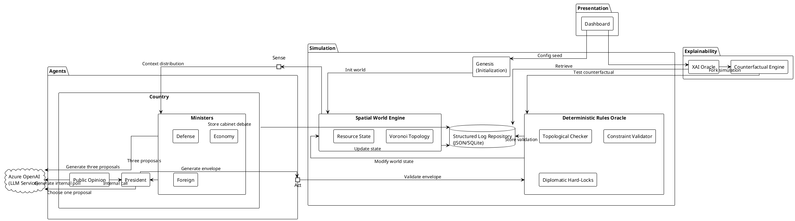

# 🏗 GeoMAS Architecture

## 🗺️ High-Level Overview
GeoMAS è strutturato in 4 Layer distinti per garantire modularità e testabilità.

### Layer 1: Presentation (UI)
*   **Dashboard (Streamlit):** Interfaccia utente per configurazione e analisi.
*   **Responsabilità:** Inviare il `Config Seed` e visualizzare i dati dal `Structured Log Repository`.

### Layer 2: Explainability (XAI)
*   **XAI Oracle:** Il motore di ragionamento che analizza i log.
*   **Counterfactual Engine:** Esegue simulazioni "What-If" forkando lo stato del mondo.
*   **Responsabilità:** Rispondere a query "Why?" e "Why not?" interrogando il `Deterministic Rules Oracle`.

### Layer 3: Simulation (Core)
*   **Genesis:** Modulo di inizializzazione (Cold Start).
*   **Spatial World Engine:** Gestisce la topologia Voronoi e lo stato delle risorse.
*   **Deterministic Rules Oracle:** L'arbitro imparziale. Valida ogni azione contro i vincoli (budget, trattati, fisica).
*   **Structured Log Repository:** Database centrale (JSON/SQLite) che mantiene la "Single Source of Truth".

### Layer 4: Agents (Cognitive)
*   **Country Container:**
    *   **Ministers (Defense, Economy, Foreign):** Propongono azioni basate sul loro dominio.
    *   **Public Opinion:** Modulo reattivo che vincola il governo.
    *   **President:** Aggregatore decisionale finale.
*   **External Services:** Azure OpenAI per la generazione di testo e decisioni complesse.

---

## 📐 PlantUML Diagram
Copia questo codice in un visualizzatore PlantUML per vedere la struttura esatta.

